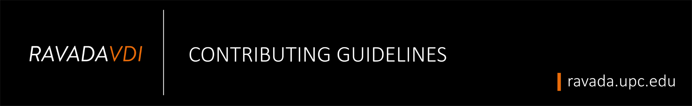

[](https://ravada.upc.edu/)

# How to contribute to Ravada VDI

Welcome to our ever-growing community :octocat:!

Ravada is an open-source project that allows users to connect to a virtual desktop. It is a VDI broker.

We are more than happy to accept external contributions to the project in the form of feedback, translations, bug reports, and even better, pull requests. It's people like you that make it such a great tool.

# <a name="top"></a>Table of contents

- 1 [See what’s going on](#1)
  - 1.1 [Issue Dashboard](#1.1)
  - 1.2 [Pull Request Dashboard](#1.2)
- 2 [Assistance](#2)
  - 2.1 [Live Support](#2.1)
  - 2.2 [Discussions](#2.2)
- 3 [Feature Requests](#3)
  - 3.1 [Requirement for a Feature Request](#3.1)
    - 3.1.1 [Major Feature Request](#3.1.1)
    - 3.1.2 [Minor Feature Request](#3.1.2)
  - 3.2 [Request a New Feature](#3.2)
- 4 [Submitting](#4)
  - 4.1 [How to Submit an Issue or Bugs](#4.1)
    - 4.1.1 [Check for Past Issues or Bugs](#4.1.1)
    - 4.1.2 [Try to Reproduce It!](#4.1.2)
    - 4.1.3 [Isolate the Problem](#4.1.3)
    - 4.1.4 [Information Needed for the Report](#4.1.4)
    - 4.1.5 [Submit an Issue](#4.1.5)
  - 4.2 [How to Create a Pull Request (PR)](#4.2)
    - 4.2.1 [Create a Fork](#4.2.1)
      - 4.2.1.1 [Keep updated your Fork](#4.2.1.1)
    - 4.2.2 [Create a Branch and Naming it](#4.2.2)
    - 4.2.3 [Make Changes](#4.2.3)
    - 4.2.4 [Commit Your Changes](#4.2.4)
      - 4.2.4.1 [Rules to Follow](#4.2.4.1)
      - 4.2.4.2 [Commit Format](#4.2.4.2)
        - 4.2.4.2.1 [Header: Writing a `type`](#4.2.4.2.1)
        - 4.2.4.2.2 [Header: Writing the `(optional scope)`](#4.2.4.2.2 )
        - 4.2.4.2.3 [Header: Writing a `description`](#4.2.4.2.3)
        - 4.2.4.2.4 [Header Lenght](#4.2.4.2.4)
        - 4.2.4.2.5 [Writing the `optional body`](#4.2.4.2.5)
        - 4.2.4.2.6 [Writing the `optional footer`](#4.2.4.2.6)
      - 4.2.4.3 [Commit Examples](#4.2.4.3)
    - 4.2.5 [Push your Changes](#4.2.5)
    - 4.2.6 [Create a Pull Request](#4.2.6)
      - 4.2.6.1 [How to Write a Title for a Pull Request](#4.2.6.1)
      - 4.2.6.2 [Before Send a Pull Request](#4.2.6.2)
      - 4.2.6.3 [How We Check your Submission](#4.2.6.3)
        - 4.2.6.3.1 [Status Check](#4.2.6.3.1)
        - 4.2.6.3.2 [App/Bots List](#4.2.6.3.2)
    - 4.2.7 [How to proceed with suggestions](#4.2.7)
- 5 [What to do next?](#5)
- 6 [Coding Rules](#6)

# <a name="1"></a> 1. See what's going on! [:top:](#top)

## <a name="1.1"></a> 1.1 Issue Dashboard
If you want to know all the issues we're dealing with right now, take a look at our [Issue Dashboard](https://github.com/UPC/ravada/issues) and look for areas in which you can help.

## <a name="1.2"></a> 1.2 Pull Request Dashboard
If you want to give us a hand solving issues then great, take a look at our [Pull Request Dashboard](https://github.com/UPC/ravada/pulls) and check for an open or closed PR. We don’t want to duplicate efforts.

# <a name="2"></a> 2. Assistance [:top:](#top)

## <a name="2.1"></a> 2.1 Live Support
You can find us in [Telegram](https://t.me/ravadavdi), we'll help you as soon as possible.

## <a name="2.2"></a> 2.2 Discussion
For general discussion, use the [Ravada mailing list](https://groups.google.com/forum/#!forum/ravada).

# <a name="3"></a> 3. Feature Requests [:top:](#top)

If you'd like to make a suggestion, you must first search the existing issues, both opened and closed. Your idea may have already been suggested!

## <a name="3.1"></a> 3.1 Requirement for a Feature Request
If you like to _implement_ a new feature please [submit an Issue](https://github.com/UPC/ravada/issues/new?template=Feature_request.md) with a proposal, so we can be sure it's relevant.

### <a name="3.1.1"></a> 3.1.1 Major Feature Request
For a major new feature request, [open an Issue](https://github.com/UPC/ravada/issues/new?template=Feature_request.md) and outline your proposal so it can be discussed.

### <a name="3.1.2"></a> 3.1.2 Minor Feature Request
For a minor new feature request, you can craft it and directly [submit it as a Pull Request](https://github.com/UPC/ravada/pulls), we'll take care of it.

## <a name="3.2"></a> 3.2 Request a New Feature
You can request a new feature by [submitting an Issue](https://github.com/UPC/ravada/issues/new?template=Feature_request.md)

# <a name="4"></a> 4. Submitting [:top:](#top)

## <a name="4.1"></a> 4.1 How to Submit an Issue or Bugs

A good Issue/Bug report shouldn't leave others needing to chase you up for more information. Please try to be as detailed as possible in your report. What is your environment? What steps will reproduce the issue? What would you expect to be the outcome? All these details will help people to fix any potential bugs.

A bug is a _demonstrable problem_ that is caused by the code in the repository. If you're getting a problem when you try to install, there is a good chance that your server is not configured properly. See the [troubleshooting guide](https://ravada.readthedocs.io/en/latest/docs/troubleshooting.html) for help. Good bug reports are extremely helpful, here are steps to follow to build a good one:

### <a name="4.1.1"></a> 4.1.1 Check for Past Issues or Bugs
Before submitting the issue please check the [Issue Tracker](https://github.com/UPC/ravada/issues), maybe the issue/bug was already reported by another contributor. By doing this you help us maximize the effort spent on solving problems and the addition of new features.

### <a name="4.1.2"></a> 4.1.2 Try to Reproduce It!
Try to reproduce this issue/bug using the latest `master` branch in the repository [Check it here](https://github.com/UPC/ravada/branches).

### <a name="4.1.3"></a> 4.1.3 Isolate the Problem
Ideally, create a reduced test case. We prefer bug reports with small, portable test cases.

### <a name="4.1.4"></a> 4.1.4 Information Needed for the Report
We require the following information:

* :warning: **Observed Results:** A brief description of the problem.
* :mag_right: **What steps will reproduce the issue?:** If suitable, including the steps required to reproduce the bug.
* :boom: **Expected Results:** What did you expect to happen?

### <a name="4.1.5"></a> 4.1.5 Submit an Issue. :rocket:
Having all data at hand, file the new issue by filling out our [Issue form](https://github.com/UPC/ravada/issues/new?template=Bug_report.md).

**&mdash; That's it! :tada:**

## <a name="4.2"></a> 4.2 How to Create a Pull Request (PR) [:top:](#top)

Before submitting a Pull Request, check for an open or closed PR that relates to your submission. We don't want to duplicate efforts.

### <a name="4.2.1"></a> 4.2.1 Create a Fork

Fork the repository before making any changes, a fork is a copy of the repository which allows you to _freely experiment with changes_ without affecting the original project.

Go to the top-right corner on GitHub, and click on 

### <a name="4.2.1.1"></a> 4.2.1.1 Keep updated your Fork

To avoid and also to solve conflicts in your PR, you must update your Fork since other team mates may have already submitted their work.

Following this [Gist](https://gist.github.com/CristinaSolana/1885435):

**1 - Clone your fork**

```git clone git@github.com:YOUR-USER-NAME/ravada.git```

**2 - Add remote upstream**

```shell

cd path/to/your/fork/
git remote add upstream git://github.com/UPC/ravada.git

```

**3 - Update your fork**

```shell

git fetch upstream
git pull upstream master

```

:memo: **Note:** You can pull from any branch of the remote repo.

### <a name="4.2.2"></a> 4.2.2 Create a Branch and Naming it

The project is organized according to the branch model [Git Flow](http://nvie.com/posts/a-successful-git-branching-model/). Create a new branch before committing any changes. A _branch is a parallel version of a repository._ It is contained within the repository but does not affect the **`primary or master`** branch.

:heavy_exclamation_mark: **Branch Name Format: `feature/issue_number-my-killer-feature`**.

:no_entry_sign: **Important:** Do not commit to our default **`develop`** branch. Name it anything _except master, develop, release-*, or hotfix-*_. We'll use **`1-created-branch`** an example.

### <a name="4.2.3"></a> 4.2.3 Make Changes

Make your changes in your **newly created** branch.

```console

    git checkout -b feature/1-created-branch master

```

Follow this guide about running [Ravada in development mode](http://ravada.readthedocs.io/en/latest/devel-docs/run.html).

If you change a translation or language file make sure you follow this small [guide](http://ravada.readthedocs.io/en/latest/devel-docs/translations.html).

### <a name="4.2.4"></a> 4.2.4 Commit Your Changes
A commit, or "revision", is an individual change to a file (or set of files). It's like when you save a file, except with Git, every time you save it creates a unique ID (a.k.a. the "SHA" or "hash") that allows you to keep a record of what changes were made when and by who. Commits usually contain a commit message which is a brief description of what changes were made.

### <a name="4.2.4.1"></a> 4.2.4.1 Rules to Follow
For commits, we follow the [Conventional Commit](http://conventionalcommits.org/). This leads to **more readable messages** that are easy to follow when looking through the project history. But also, we use the git commit messages to **automatically generate changelogs** from these messages.

### <a name="4.2.4.2"></a> 4.2.4.2 Commit Format
Each commit message consists of a **header**, a **body**, and a **footer**. Each commit must be for a reason, and we should have an issue for that, so we decided to add the issue number in the footer.

The header has a special format that includes a **type**, a **scope**, and a **description**:

**:warning: Important:** Please avoid generic terms.

The commit message should be structured as follows:

```console
type(optional scope): description
<blank line>
optional body
<blank line>
footer #issue
```

### <a name="4.2.4.2.1"></a> 4.2.4.2.1 Header: Writing a `type`
Commits must be prefixed with a type, which consists of a verb, **feat, fix, build,** followed by a colon and space.

**Your options:**

* **build**: Changes that affect the build system or external dependencies (example scopes: gulp, broccoli, npm).
* **ci**: Changes to our CI configuration files and scripts (example scopes: Travis, Circle, BrowserStack, SauceLabs).
* **docs**: Documentation only changes.
* **feat**: A new feature.
* **fix**: A bug fix.
* **perf**: A code change that improves performance.
* **refactor**: A code change that neither fixes a bug or adds a feature.
* **style**: Changes that do not affect the meaning of the code (white-space, formatting, missing semi-colons, etc).
* **test**: Adding missing tests or correcting existing tests.

---
>**Example for `type`:**
>:point_right:feat:point_left:(parser): add ability to parse arrays
---

### <a name="4.2.4.2.2"></a> 4.2.4.2.2 Header: Writing the `(optional scope)`
Refers to the extent, subject matter or contextual information about your changes. A scope is a phrase describing the file modified or a section of the codebase, it’s always enclosed in parenthesis.

---
> **Example for a `(optional scope)`:**
> feat:point_right:(parser):point_left:: add ability to parse arrays
---

### <a name="4.2.4.2.3"></a> 4.2.4.2.3 Header: Writing a `description`
A description must immediately follow the **`type(optional scope):`** The description is a short description of the commit.

**Important**
* About commit character length, keep it concise and don't write more than **50 characters**.
* Use the imperative present tense: change, make, add, update, fix, etc; Do not use changed, changes, added, fixes, fixed, etc.
* Don't capitalize the first letter.
* Do not use a dot (.) at the end.

---
>**Example for `<description>`**:
>feat(parser)::point_right:add ability to parse arrays:point_left:
---

### <a name="4.2.4.2.4"></a> 4.2.4.2.4 Header Lenght
The **header** cannot be longer than 100 characters. This allows the message to be easier to read on GitHub as well as in various git tools.

### <a name="4.2.4.2.5"></a> 4.2.4.2.5 Writing the `optional body`
The body should include the motivation for the change and contrast this with previous behavior.

---
>**Example for `optional body`**:
```console
fix orthography
remove out of date paragraph
fix broken links
```
---

### <a name="4.2.4.2.6"></a> 4.2.4.2.6 Writing the `optional footer`
The `<optional footer>` should contain a [closing reference to an issue](https://help.github.com/articles/closing-issues-using-keywords/) if any.

For example, to close an issue numbered **`123`**, you could use the phrases **`Closes #123`** in your pull request description or commit message. Once the branch is merged into the default branch, the issue will close.

---
>**Example for `optional footer`**:
>:point_right:Closes #123:point_left:
---

### <a name="4.2.4.3"></a> 4.2.4.3 Commit Examples
:shit:
**Bad**

```console
docs(readme): fix orthography, remove out of date paragraph and fix broken links
```

:+1:
**Good**

```console
docs(readme): document design improvement change content

fix orthography
remove out of date paragraph
fix broken links
```

### <a name="4.2.5"></a> 4.2.5 Push your Changes
Pushing refers to **sending your committed changes to a remote repository**, such as a repository hosted on GitHub. For instance, if you change something locally, you'd want to then push those changes so that others may access them.

After working on your changes you need to Push it (upload) your **newly created branch** to GitHub

```git push origin feature/1-created-branch```

Then you'll need to run:

```git push --set-upstream-to origin feature/1-created-branch```

### <a name="4.2.6"></a> 4.2.6 Create a Pull Request

Pull requests or PR are **proposed changes** to a repository submitted by a user and accepted or rejected by a repository's collaborators.

After all the work being pushed to the newly created branch, In GitHub, send a pull request to our [repository.](https://github.com/UPC/ravada/pulls)

### <a name="4.2.6.1"></a> 4.2.6.1 How to Write a Title for a Pull Request
Pull Request should be named in reference to the main fix or feature you provide; minor information can be added to the description.

**:warning: Important:** Please avoid generic terms.

:straight_ruler:
**Title Length:** Keep it concise and don't write more than **50 characters** in the title.

:construction:
**For Work in Progress (WIP):** If you don’t want your PR to be merged accidentally, add the word "wip" or "WIP" to its title and the [WIP bot](https://github.com/apps/wip) will set its status to error.

---
>**Example for `Titles for work in progress (WIP):`**
>:point_right:WIP Added a Table of Content for the Contributing Guideline Document.:point_left:
---

:white_check_mark:
**Finalized Work:** If you are done with your work and want it to be merged, just write a descriptive title with no more than 50 characters.

---
>**Example for `Titles for Finalized Work:`**
>:point_right:Added a Table of Content for the Contributing Guideline Document.:point_left:
---

### <a name="4.2.6.2"></a> 4.2.6.2 Before Send a Pull Request

**1 - Pull Request Description:** Write a description about the changes, we provide a [template](https://github.com/UPC/ravada/community) for Pull Request descriptions. When you're creating a Pull Request it'll be shown automatically. Just fill it out and you're done.

**2 - Choose the right label**: Look at the [list of available labels.](https://github.com/UPC/ravada/issues/labels)

**3 - Smash that button!** Press that _Create Pull Request_ button and you're done.

**&mdash; That's it! :tada:**

### <a name="4.2.6.3"></a> 4.2.6.3 How We Check your Submission

#### <a name="4.2.6.3.1"></a> 4.2.6.3.1 Status Check :rotating_light:

Required status checks ensure us that all required tests are passing before collaborators can make changes to a protected branch. We enforce status checks before a branch is merged.

The type of required status check we choose is _Loose_, not all of them are required but some of them determines whether your changes will be reviewed or not. Some of them are here on this list, although, some of them may not be implemented in all repositories:

#### <a name="4.2.6.3.2"></a> 4.2.6.3.2 App/Bots List :traffic_light:

**WIP:** Refers to Work In Progress, this app helps you to prevent your PR to be merged accidentally, add the word "wip" or "WIP" to its title and WIP bot will set its status to error. When you write WIP in the PR title it means that your changes are still in progress or unfinished, so it won't be reviewed until the WIP is removed.

_WIP: Maintainers: Required / Contributors: Required_

**AccessLint:** When a pull request is opened, AccessLint reviews the changes and comments with any new accessibility issues, giving you quick, timely, and targeted feedback, before code goes live.

_AccessLint: Maintainers: Required / Contributors: Required_

**GPG:** After installation, this app checks all commits of new (or newly updated) pull requests for valid GPG signatures according to the GitHub API.

_GPG: Maintainers: Required / Contributors: Optional_

**commitlint:** Runs commitlint against all commits of new or edited pull requests and sets an appropriate status check.

_commitlint: Maintainers: Required / Contributors: Required_

**DCO:** This App enforces the Developer Certificate of Origin (DCO) on Pull Requests. It requires all commit messages to contain the Signed-off-by line with an email address that matches the commit author.

_DCO: Maintainers: Required / Contributors: Optional_

**DEP:** A Github App that helps to manage Pull Request dependencies. That App works similar to typical CI services ( e.g Travis) but instead of running a test suite, It will check whether a pull request dependencies are resolved.

_DEP: Maintainers: Required / Contributors: Required_

**ci/circleci build:** CircleCI acts as a platform for both Continuous Integration and Continuous Deployment. If your tests pass, then you can deploy your code to development, staging, production, or other environments.

_ci/circleci build: Maintainers: Required / Contributors: Required_

**continuous-integration/travis-ci/push(and pr):** An automatic construction of the requested changes is carried out and the tests are executed automatically.

_continuous-integration/travis-ci/push(and pr): Maintainers: Required / Contributors: Required_

### <a name="4.2.7"></a> 4.2.7 How to proceed with suggestions

If we suggest changes then:
* Make the required updates.
* Re-run the test suites to ensure tests are still passing.
* Rebase your branch and force push to your GitHub repository (this will update your Pull Request):

    ```shell
    git rebase develop -i
    git push -f
    ```
:warning:
**Remove the WIP label:** When a PR is ready for review, remove the prefix WIP in the PR title.

# 5. <a name="5"></a> What to do next? [:top:](#top)

After your pull request is merged, you can safely delete your branch and pull the changes
from the main (upstream) repository:

* Delete the remote branch on GitHub either through the GitHub web UI or your local shell as follows:

    ```shell
    git push origin --delete feature/1-created-branch
    ```

* Check out the master branch:

    ```shell
    git checkout master -f
    ```

* Delete the local branch:

    ```shell
    git branch -D feature/1-created-branch
    ```

* Update master with the latest upstream version:

    ```shell
    git pull --ff upstream master
    ```

# 6. <a name="6"></a> Coding Rules [:top:](#top)

To ensure consistency throughout the source code, keep these rules in mind as you are working:

* All features or bug fixes must be tested by one or more specs (unit-tests). See this documentation about [testing](http://ravada.readthedocs.io/en/latest/devel-docs/commit-rules.html#testing) the project.
* All methods must be documented.
* Code Style: see our
[editor configuration](http://ravada.readthedocs.io/en/latest/devel-docs/editor-rules.html)
guidelines so your code gets along with old code. A recurrent problem for newcommers
is to submit code automatically cleaned by the editor. Usually, removed end of line
spaces or spaces converted to tabs.
Please make sure you don't do that. Run ``git diff`` before commit to see what you are
exactly contributing.
* We recommend that you install a local development server on your computer, rather than testing your code directly on the production server. This means you can test your code directly on your own computer, making development faster and without the risk of exposing sensitive information to the public.

# Good luck! :tada:

[](https://ravada.upc.edu/)