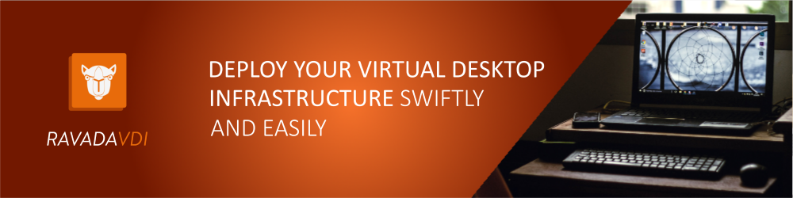

# Ravada

## Remote Virtual Desktops Manager

Ravada is a software that allows the user to connect to a remote virtual desktop.

To get started, check out [Ravada Website](https://ravada.upc.edu/)!

## Table of Contents

* [Synopsis](#synopsis)
* [Installation](#installation)
* [Documentation](#documentation)
* [Versioning](#versioning)
* [Contact](#contact)
* [Professional services](#professional-services)
* [Contribute](#contribute)
* [Copying](#copying)

## Synopsis

Ravada is an open-source project that allows users to connect to a virtual desktop. It is a VDI broker.

Its back-end has been designed and implemented in order to allow future hypervisors to be added to the framework. Currently it supports [KVM](http://www.linux-kvm.org/) and [LXC](https://linuxcontainers.org/) support is currently in development.

### Features

* KVM backend for Windows and Linux Virtual machines
* LDAP and SQL authentication
* Kiosk mode
* Remote Access with [Spice](http://www.spice-space.org/) for Windows and Linux
* Light and fast virtual machine clones for each user
* Instant clone creation
* USB redirection
* Easy and customizable end users interface
* Administration from a web browser

## Installation

Read [INSTALL](http://ravada.readthedocs.io/en/latest/docs/INSTALL.html).

## Documentation

We maintain a detailed [documentation on Read the Docs](http://ravada.rtfd.io/).

* See [production](http://ravada.readthedocs.io/en/latest/docs/production.html) for production fine-tuning guidelines.
* See [operation](http://ravada.readthedocs.io/en/latest/docs/operation.html).
* See [update](http://ravada.readthedocs.io/en/latest/docs/update.html).

## Versioning

In order to provide transparency on our release cycle and to maintain backward compatibility, this project is maintained under [the Semantic Versioning guidelines](http://semver.org/). We are committed to following and complying with the rules, the best we can.

See [the tags section of our GitHub project](https://github.com/UPC/ravada/releases) for changelogs for each release version.

## Contact

You can chat with us if you get stuck [@ravadavdi on Telegram](https://t.me/ravadavdi).

## Professional Services

The Flyve MDM and GLPI Network services are available through our [Partner's Network](http://www.teclib-edition.com/en/partners/). We provide special training, bug fixes with editor subscription, contributions for new features, and more.

Obtain a personalized service experience, associated with benefits and opportunities.

## Contribute

Want to file a bug, contribute some code, or improve documentation? Excellent! Read up on our
guidelines for [contributing](https://github.com/UPC/ravada/blob/master/CONTRIBUTING.md) and then check out one of our issues in the [Issues Dashboard](https://github.com/UPC/ravada/issues).

## Copying

* **Name**: [Ravada](https://ravada.upc.edu/) is a registered trademark of [UPC](http://www.upc.edu).
* **Code**: you can redistribute it and/or modify
    it under the terms of the GNU Affero General Public License ([AGPLv3](https://www.gnu.org/licenses/agpl-3.0.en.html)).
* **Documentation**: released under Attribution 4.0 International ([CC BY 4.0](https://creativecommons.org/licenses/by/4.0/)).